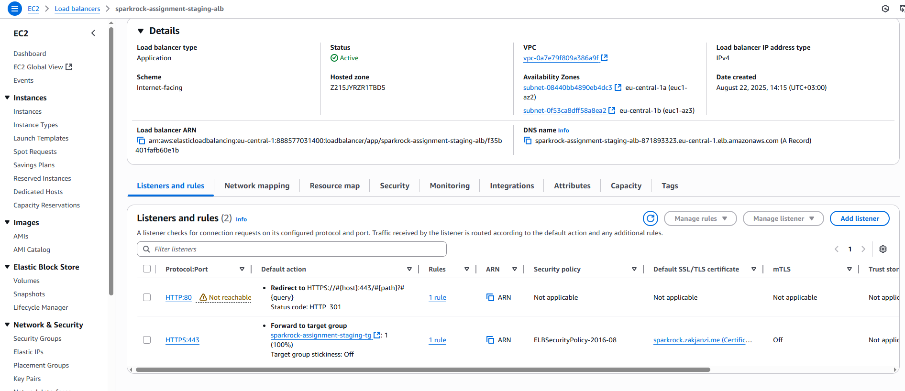
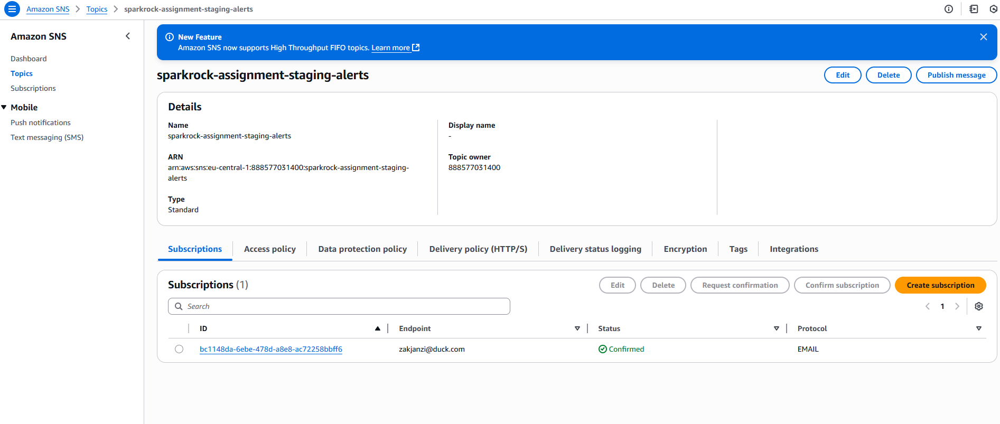

# Docs & Evidence

This folder contains screenshots and artifacts demonstrating the working deployment, CI/CD, security, and monitoring. For detailed documentation on this project and my thought process, refer to the readme doc in the root dir.

## Screenshots

- **Architecture**

  

- **GitHub Actions (success)**

  

- **ECR repositories**

  

- **ECS service healthy**

  

- **ECS service task list**

  

- **ALB listeners**

  

- **CloudWatch alarm (OK)**

  

- **SNS email**

  

- **Email Screenshot**

  

- **Site 401**

  

- **Site 200**

  

- **ACM issued**

  

- **Cloudflare CNAME**

  

